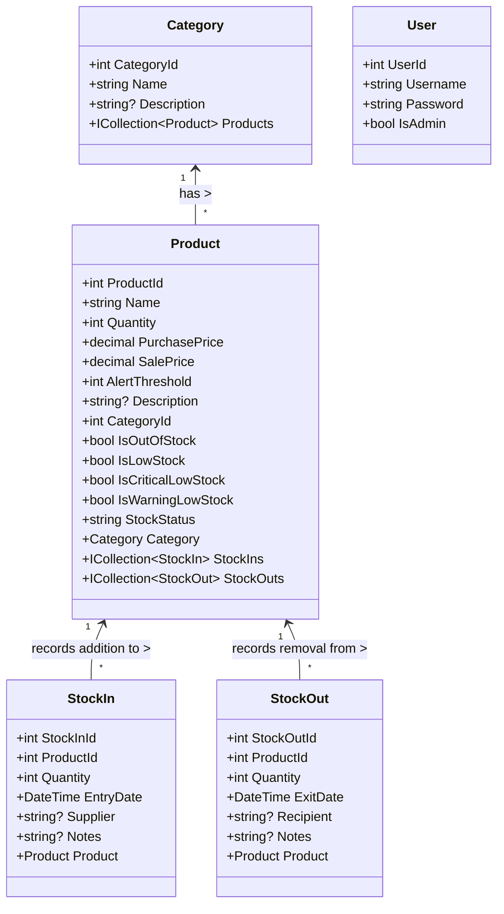

# GestionDeStock - Entity Class Diagram

This diagram focuses exclusively on the entity classes (data models) and their relationships.

## Relationship Details

### One-to-Many: Category to Product
- Each Category can contain multiple Products
- Each Product belongs to exactly one Category
- Foreign key: `Product.CategoryId` references `Category.CategoryId`

### One-to-Many: Product to StockIn
- Each Product can have multiple StockIn records
- Each StockIn record is associated with exactly one Product
- Foreign key: `StockIn.ProductId` references `Product.ProductId`

### One-to-Many: Product to StockOut
- Each Product can have multiple StockOut records
- Each StockOut record is associated with exactly one Product
- Foreign key: `StockOut.ProductId` references `Product.ProductId`

## Key Business Logic

### Product Stock Management
- `Product.Quantity`: Current quantity in stock
- `Product.PurchasePrice`: Cost price of the product
- `Product.SalePrice`: Selling price of the product
- `Product.AlertThreshold`: Minimum quantity threshold for alerts

### Computed Properties
- `Product.IsOutOfStock`: True when Quantity = 0
- `Product.IsLowStock`: True when Quantity ≤ AlertThreshold
- `Product.IsCriticalLowStock`: True when Quantity ≤ (AlertThreshold × 0.25)
- `Product.IsWarningLowStock`: True when Quantity ≤ (AlertThreshold × 0.5) and not critical
- `Product.StockStatus`: Text representation of stock status ("Out of Stock", "Critical Level", etc.) 