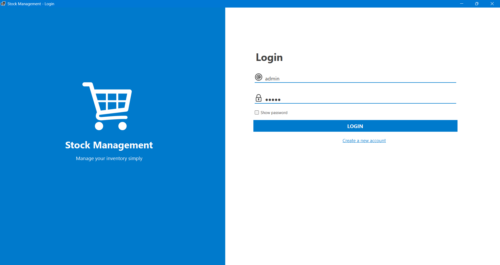
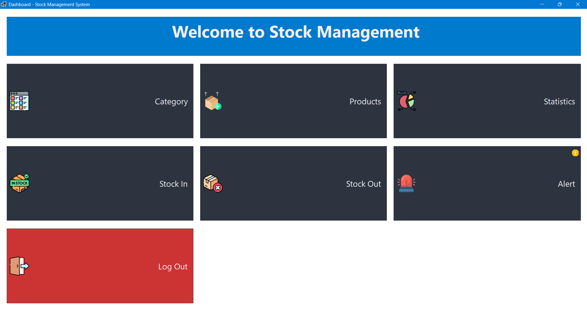
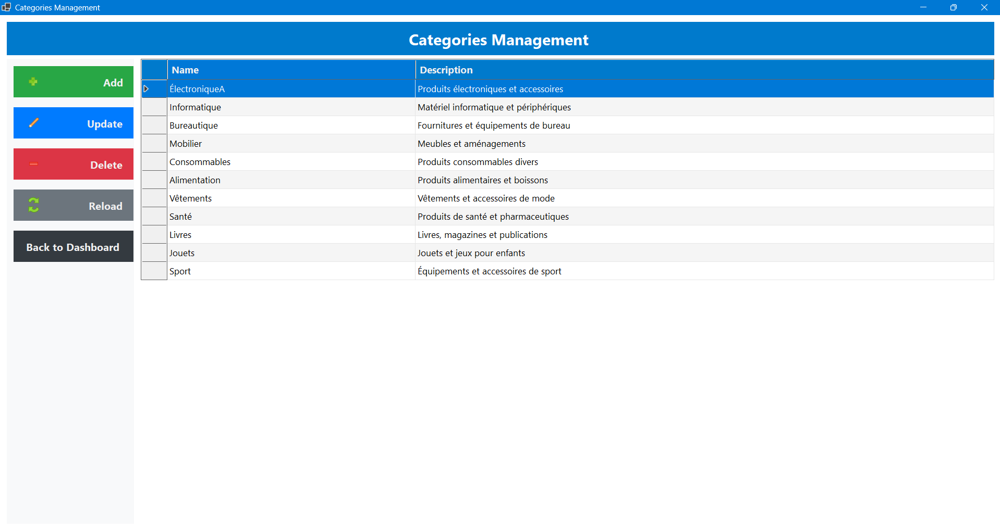
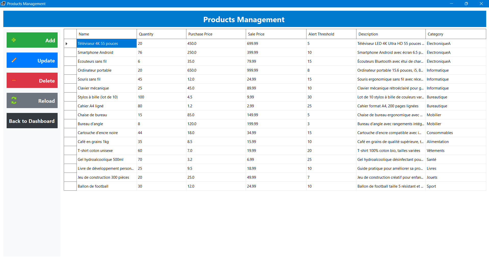

# 📊 Gestion-De-Stock: Système de Gestion d'Inventaire

[](https://dotnet.microsoft.com/languages/csharp)
[](https://dotnet.microsoft.com/)
[](https://docs.microsoft.com/en-us/ef/core/)
[](https://www.sqlite.org/)

> Un système moderne de gestion d'inventaire développé avec C# et Entity Framework Core

## 🌟 Introduction

**Gestion-De-Stock** est une solution complète et intuitive conçue pour simplifier la gestion d'inventaire des entreprises de toutes tailles. Face aux défis quotidiens de la gestion des stocks, ce logiciel offre une plateforme centralisée permettant de suivre avec précision les niveaux de stock, d'organiser les produits par catégories et de documenter tous les mouvements d'inventaire.

Développée avec des technologies modernes et une architecture robuste, cette application répond aux besoins des commerçants, entrepôts, et services logistiques en fournissant:
- Une visibilité en temps réel sur les niveaux de stock
- Des alertes automatiques pour les produits à réapprovisionner 
- Un suivi détaillé des entrées et sorties d'inventaire
- Une interface utilisateur intuitive nécessitant peu de formation

Que vous gériez une petite boutique ou un entrepôt plus important, **Gestion-De-Stock** s'adapte à vos besoins tout en maintenant une simplicité d'utilisation qui vous permet de vous concentrer sur votre cœur de métier.

## 📋 Table des Matières

- [Vue d'ensemble](#-vue-densemble)
- [Architecture](#-architecture)
- [Fonctionnalités](#-fonctionnalités)
- [Modèle de Données](#-modèle-de-données)
- [Logique Métier](#-logique-métier)
- [Interface Utilisateur](#-interface-utilisateur)
- [Stack Technique](#-stack-technique)
- [Démarrage Rapide](#-démarrage-rapide)
- [Captures d'Écran](#-captures-décran)
- [Feuille de Route](#-feuille-de-route)
- [Contribution](#-contribution)
- [Licence](#-licence)
- [Contact](#-contact)

## 🔍 Vue d'Ensemble

**Gestion-De-Stock** est une application complète conçue pour aider les entreprises à suivre leurs niveaux de stock, gérer les catégories de produits et enregistrer les mouvements de stock (entrées et sorties). Le système fournit des alertes en temps réel pour les articles à faible stock et offre des capacités de reporting détaillées pour une meilleure prise de décision.

## 🏗️ Architecture

L'application suit une architecture moderne en couches:

```
┌─────────────────────────────────────────────────────┐
│                                                     │
│             📱 Couche de Présentation               │
│         (Interface Windows Forms, UI)               │
│                                                     │
├─────────────────────────────────────────────────────┤
│                                                     │
│               🧠 Couche Métier                      │
│    (Services, Logique Métier, Validation)           │
│                                                     │
├─────────────────────────────────────────────────────┤
│                                                     │
│            💾 Couche d'Accès aux Données            │
│         (Repositories, Entity Framework Core)       │
│                                                     │
├─────────────────────────────────────────────────────┤
│                                                     │
│               🗃️ Stockage de Données                │
│                 (Base de Données SQLite)            │
│                                                     │
└─────────────────────────────────────────────────────┘
```

### Principaux Patterns Architecturaux

- **🔄 Pattern Repository**: Abstraction des opérations d'accès aux données
- **💉 Injection de Dépendances**: Favorise un couplage faible entre les composants
- **📝 Opérations CRUD**: Opérations standard de Création, Lecture, Mise à jour et Suppression
- **🚨 Système de Notification**: Alertes pour les produits à faible stock ou épuisés

## ✨ Fonctionnalités

- **📦 Gestion des Produits**
  - Ajouter, mettre à jour et supprimer des produits
  - Catégoriser les produits pour une organisation efficace
  - Suivre les prix d'achat et de vente
  - Définir des seuils d'alerte pour les avertissements de stock bas

- **🗂️ Gestion des Catégories**
  - Créer et gérer des catégories de produits
  - Organiser l'inventaire par catégorie pour une meilleure visibilité

- **📥 Opérations d'Entrée de Stock**
  - Enregistrer les ajouts d'inventaire
  - Suivre les fournisseurs et les dates d'entrée
  - Ajouter des notes pour chaque entrée de stock

- **📤 Opérations de Sortie de Stock**
  - Enregistrer les retraits d'inventaire
  - Suivre les destinataires et les dates de sortie
  - Ajouter des notes pour chaque retrait de stock

- **⚠️ Alertes de Stock**
  - Surveillance en temps réel des niveaux d'inventaire
  - Indicateurs visuels pour les articles épuisés
  - Système d'avertissement pour le stock bas avec plusieurs niveaux de gravité
  - Fonctionnalités de réapprovisionnement rapide depuis l'interface d'alerte

- **👤 Authentification des Utilisateurs**
  - Système de connexion sécurisé
  - Privilèges administrateur pour les opérations sensibles

## 📊 Modèle de Données

Les entités principales du système comprennent:

### 📋 Catégorie
- **Propriétés**:
  - CategoryId (Clé Primaire)
  - Name (Nom)
  - Description
- **Relations**:
  - One-to-Many avec Produits

### 📦 Produit
- **Propriétés**:
  - ProductId (Clé Primaire)
  - Name (Nom)
  - Quantity (Quantité)
  - PurchasePrice (Prix d'Achat)
  - SalePrice (Prix de Vente)
  - AlertThreshold (Seuil d'Alerte)
  - Description
  - CategoryId (Clé Étrangère)
- **Propriétés Calculées**:
  - IsOutOfStock (En Rupture)
  - IsLowStock (Stock Bas)
  - IsCriticalLowStock (Stock Critique)
  - IsWarningLowStock (Avertissement Stock Bas)
  - StockStatus (Statut du Stock)
- **Relations**:
  - Many-to-One avec Catégorie
  - One-to-Many avec StockIn et StockOut

### 📥 Entrée de Stock (StockIn)
- **Propriétés**:
  - StockInId (Clé Primaire)
  - ProductId (Clé Étrangère)
  - Quantity (Quantité)
  - EntryDate (Date d'Entrée)
  - Supplier (Fournisseur)
  - Notes
- **Relations**:
  - Many-to-One avec Produit

### 📤 Sortie de Stock (StockOut)
- **Propriétés**:
  - StockOutId (Clé Primaire)
  - ProductId (Clé Étrangère)
  - Quantity (Quantité)
  - ExitDate (Date de Sortie)
  - Recipient (Destinataire)
  - Notes
- **Relations**:
  - Many-to-One avec Produit

### 👤 Utilisateur
- **Propriétés**:
  - UserId (Clé Primaire)
  - Username (Nom d'utilisateur)
  - Password (Mot de passe)
  - IsAdmin (Est Administrateur)

## 🧠 Logique Métier

### 🧮 Calcul d'Inventaire
- La quantité de produit est calculée comme: Quantité Initiale + Somme(StockIn.Quantity) - Somme(StockOut.Quantity)
- Le système empêche un inventaire négatif (impossible de retirer plus que disponible)

### 🚨 Système d'Alerte
- Les produits sont signalés comme épuisés lorsque Quantité = 0
- Avertissement de stock bas lorsque Quantité ≤ Seuil d'Alerte
- Plusieurs niveaux de gravité basés sur les pourcentages de seuil:
  - Niveau critique: ≤ 25% du seuil
  - Niveau d'avertissement: ≤ 50% du seuil

### 📝 Validation des Transactions
- La quantité de sortie ne doit pas dépasser la quantité disponible du produit
- Les champs obligatoires sont validés avant l'enregistrement (nom du produit, quantité, etc.)
- Validation des prix (le prix de vente devrait généralement être supérieur au prix d'achat)

## 🖥️ Interface Utilisateur

L'application présente une interface Windows Forms moderne et réactive:

- **🏠 Tableau de Bord**: Hub central affichant les métriques clés et la navigation
- **📋 Gestion des Catégories**: Formulaire pour les opérations CRUD sur les catégories
- **📦 Gestion des Produits**: Liste complète des produits et détails
- **📥 Formulaire d'Entrée de Stock**: Enregistrer et visualiser les ajouts d'inventaire
- **📤 Formulaire de Sortie de Stock**: Enregistrer et visualiser les retraits d'inventaire
- **🚨 Centre d'Alertes**: Visualiser et gérer les articles à stock bas et épuisés

## 🛠️ Stack Technique

- **🔤 Langage**: C# (.NET 8.0)
- **🖼️ Framework UI**: Windows Forms
- **🗃️ ORM**: Entity Framework Core
- **💾 Base de Données**: SQLite
- **🔄 Patterns**: Pattern Repository, Injection de Dépendances

## 🚀 Démarrage Rapide

1. **Cloner le dépôt**
   ```
   git clone https://github.com/MarouaHattab/Gestion-De-Stock
   ```

2. **Ouvrir la solution dans Visual Studio**
   - Double-cliquez sur le fichier `GestionDeStock.sln`

3. **Restaurer les packages NuGet**
   ```
   dotnet restore
   ```

4. **Compiler la solution**
   ```
   dotnet build
   ```

5. **Exécuter l'application**
   ```
   dotnet run --project GestionDeStock
   ```

6. **Identifiants de connexion par défaut**
   - Nom d'utilisateur: `admin`
   - Mot de passe: `admin`

## 📸 Captures d'Écran











## 📈 Feuille de Route

Voici les fonctionnalités prévues pour les futures versions:

- **📱 Application mobile** pour la gestion d'inventaire en déplacement
- **📊 Tableau de bord analytique** avec graphiques et tendances
- **🔄 Synchronisation multi-appareils** pour une utilisation sur plusieurs postes
- **🖨️ Génération de rapports** personnalisables et exportables
- **👥 Gestion avancée des utilisateurs** avec rôles et permissions

## 🤝 Contribution

Les contributions sont les bienvenues! Pour contribuer:

1. Forkez le projet
2. Créez votre branche de fonctionnalité (`git checkout -b feature/amazing-feature`)
3. Committez vos changements (`git commit -m 'Add some amazing feature'`)
4. Poussez vers la branche (`git push origin feature/amazing-feature`)
5. Ouvrez une Pull Request


## 📞 Contact

Maroua Hattab - [GitHub](https://github.com/MarouaHattab)

Samah Saidi  - [GitHub](https://github.com/samah-saidi)

Lien du projet: [https://github.com/MarouaHattab/Gestion-De-Stock](https://github.com/MarouaHattab/Gestion-De-Stock)
